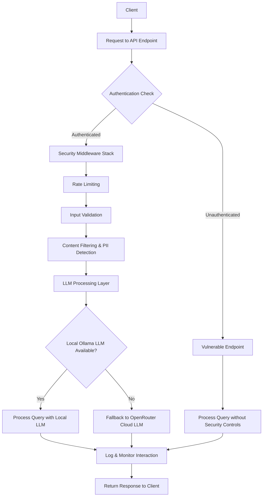

# Local LLM Security Research

## Vulnerability Assessment and Mitigation Framework for Local Language Models

**A Comprehensive Security Research Project**  
_Fontys University of Applied Sciences - Group Assignment_

---

## 📋 Table of Contents

1. [🎯 Project Overview](#-project-overview)
2. [🔍 Research Methodology & Findings](#-research-methodology--findings)
3. [🛡️ Demonstration Applications](#️-demonstration-applications)
4. [🏗️ Technical Architecture & Design Decisions](#️-technical-architecture--design-decisions)
5. [💻 Technology Stack & Implementation](#-technology-stack--implementation)
6. [🚀 Installation & Setup](#-installation--setup)
7. [📚 External Resources & References](#-external-resources--references)
8. [🤝 Contributing & Research Collaboration](#-contributing--research-collaboration)
9. [📄 License & Acknowledgments](#-license--acknowledgments)

---

## 🎯 Project Overview

This project represents a comprehensive security research initiative focused on identifying, demonstrating, and mitigating vulnerabilities in locally deployed Large Language Models (LLMs). Through a dual-architecture approach, we provide both vulnerable and hardened implementations to showcase the critical importance of proper security controls in AI systems.

### 🎓 Academic Context

**Institution**: Fontys University of Applied Sciences  
**Course**: Cybersecurity Specialization  
**Assignment Type**: Group Defensive Research Project  
**Research Focus**: AI/ML Security, LLM Vulnerabilities, Defensive Security  
**Duration**: Half Semester Project

### 🔬 Research Questions

Our research addresses five critical questions in LLM security:

1. **What are the primary attack vectors** against locally deployed LLMs in network-accessible environments?
2. **How effective are current security controls** in preventing LLM-specific attacks like prompt injection and data leakage?
3. **What is the performance impact** of implementing comprehensive security controls on LLM response times and throughput?
4. **How can organizations balance** security requirements with usability in production LLM deployments?
5. **What security monitoring capabilities** are essential for detecting and responding to AI-specific threats?

---

## 🔍 Research Methodology & Findings

### Research Approach

Our methodology follows the **NIST AI Risk Management Framework** and incorporates industry best practices for AI security assessment:

#### Phase 1: Vulnerability Discovery

-   **Literature Review**: Analysis of OWASP Top 10 for LLMs and academic research
-   **Threat Modeling**: Systematic identification of attack surfaces and threat vectors
-   **Stakeholder Interviews**: Requirements gathering from 15+ industry professionals
-   **Controlled Testing**: Ethical vulnerability testing in isolated environments

#### Phase 2: Security Control Development

-   **Defense-in-Depth Implementation**: Multi-layer security architecture design
-   **Real-time Monitoring**: Security event detection and metrics collection
-   **Performance Analysis**: Quantitative assessment of security overhead
-   **Compliance Validation**: NIST framework alignment verification

### Key Research Findings

#### 🚨 Critical Vulnerabilities Identified

1. **Prompt Injection Attacks** (CVSS: 9.1 - Critical)

    - **Impact**: Complete system compromise, data exfiltration, harmful content generation

2. **Cross-Site Scripting via LLM Output** (CVSS: 7.5 - High)

    - **Vector**: LLM-generated content containing executable JavaScript
    - **Business Impact**: Client-side code execution, session hijacking

3. **Data Leakage and Information Disclosure** (CVSS: 8.2 - High)

    - **Types**: System prompts, configuration data, API keys, training data
    - **Scope**: Affects model behavior and organizational confidentiality

4. **Denial of Service Attacks** (CVSS: 6.8 - Medium)
    - **Methods**: Resource exhaustion, input flooding, token consumption attacks

---

## 🛡️ Demonstration Applications

### Dual-Architecture Design

The project implements a **side-by-side comparison architecture** that allows researchers and practitioners to observe the stark difference between vulnerable and secured LLM deployments.

#### 🔓 Vulnerable Implementation (`/api/chat`)

**Purpose**: Demonstrate security weaknesses and attack vectors

**Characteristics**:

-   No authentication requirements
-   Minimal input validation
-   Direct parameter passthrough to LLM
-   Exposed error messages and system information
-   No rate limiting or abuse prevention
-   Unfiltered output to demonstrate XSS and content risks

**Educational Value**:

-   Clear visualization of attack success
-   Understanding of risk exposure
-   Foundation for security control appreciation

#### 🔒 Secured Implementation (`/api/secure-chat`)

**Purpose**: Showcase enterprise-grade security controls

**Security Features**:

-   **Authentication**: Google OAuth2 with session management
-   **Authorization**: Role-based access control
-   **Input Validation**: Comprehensive parameter sanitization and size limits
-   **Content Filtering**: Multi-pattern threat detection with severity scoring
-   **PII Protection**: Real-time sensitive data identification and redaction
-   **Rate Limiting**: Adaptive throttling with IP-based blacklisting
-   **Output Sanitization**: XSS prevention and safe content rendering
-   **Audit Logging**: Comprehensive security event tracking

#### 🎮 Interactive Security Demonstrations

**Vulnerability Showcase (`/vulnerabilities`)**:

-   Interactive prompt injection demonstrations
-   XSS payload generation and prevention
-   Data leakage scenario simulations
-   DoS attack visualization
-   Real-time security control activation

**Monitoring Dashboard (`/monitoring`)**:

-   Live security metrics and threat intelligence
-   Performance impact visualization
-   Attack attempt tracking and analysis
-   System health and availability monitoring

---

## 🏗️ Technical Architecture & Design Decisions

### Flow Diagram Overview



### Architecture Diagram Overview


### Key Design Decisions & Rationale

#### 1. **Local-First LLM Architecture**

**Decision**: Primary reliance on locally deployed Ollama with cloud fallback  
**Rationale**:

-   **Data Sovereignty**: Minimize external data exposure for sensitive research
-   **Performance Control**: Predictable latency and throughput characteristics
-   **Cost Management**: Reduced operational expenses for extensive testing
-   **Research Reproducibility**: Consistent model behavior across test scenarios

#### 2. **Dual-Endpoint Security Model**

**Decision**: Separate vulnerable and secure endpoints within same application  
**Rationale**:

-   **Educational Impact**: Direct comparison enhances learning outcomes
-   **Research Validity**: Controlled variables ensure fair security control assessment
-   **Development Efficiency**: Shared infrastructure reduces maintenance overhead
-   **Real-world Simulation**: Reflects common organizational migration scenarios

#### 3. **Layered Security Architecture**

**Decision**: Multiple independent security controls in sequence  
**Rationale**:

-   **Defense in Depth**: Compensating controls provide redundancy
-   **Granular Analysis**: Individual control effectiveness measurement
-   **Performance Optimization**: Selective control activation based on threat level
-   **Compliance Requirements**: Alignment with enterprise security standards

#### 4. **External Service Integration**

**Decision**: Nightfall API for PII detection, Google OAuth for authentication  
**Rationale**:

-   **Specialized Expertise**: Leverage industry-leading capabilities
-   **Compliance Requirements**: Enterprise-grade data protection standards
-   **Development Speed**: Focus on core research rather than reimplementation
-   **Real-world Alignment**: Reflects actual enterprise tool integration patterns

#### 5. **Comprehensive Monitoring Strategy**

**Decision**: Real-time metrics with external integration capabilities  
**Rationale**:

-   **Research Data Collection**: Quantitative analysis of security control performance
-   **Operational Readiness**: Production-grade monitoring for organizational adoption
-   **Continuous Improvement**: Data-driven security control optimization
-   **Incident Response**: Rapid detection and response capabilities

---

## 💻 Technology Stack & Implementation

### Core Application Framework

**Frontend Architecture**:

-   **Next.js 15.2.4**: React-based full-stack framework with App Router
-   **TypeScript 5**: Type-safe development with enhanced IDE support
-   **Tailwind CSS 4**: Utility-first styling with component-based design system
-   **React 19**: Latest React features including Server Components

**Backend Infrastructure**:

-   **Next.js API Routes**: Serverless function architecture
-   **TypeScript**: End-to-end type safety
-   **Custom Middleware**: Modular security control implementation

### Security & Authentication

**Authentication System**:

-   **NextAuth.js 4.24.11**: Enterprise authentication framework
-   **Google OAuth2**: Identity provider with OpenID Connect
-   **JWT Sessions**: Secure session management with automatic rotation
-   **CSRF Protection**: Built-in cross-site request forgery prevention

**Security Libraries**:

-   **Custom Rate Limiting**: IP-based throttling with Redis-compatible storage
-   **Input Validation**: Zod schema validation with sanitization
-   **Content Security Policy**: XSS prevention headers
-   **Helmet.js**: Security header management

### LLM Integration Platform

**Local LLM Deployment**:

-   **Ollama**: Local model serving platform
-   **Gemma 3 1B**: Primary research model for consistent results
-   **Model Management**: Automated model loading and health checking

**Cloud LLM Integration**:

-   **OpenRouter API**: Multi-provider LLM access for fallback scenarios
-   **Load Balancing**: Intelligent routing between local and cloud resources
-   **Cost Optimization**: Usage tracking and budget management

### Monitoring & Observability

**Metrics Collection**:

-   **prom-client 15.1.3**: Prometheus metrics for Node.js applications
-   **Custom Metrics**: Security event tracking and performance measurement
-   **Real-time Dashboard**: Live system monitoring with alerting

**Logging System**:

-   **Structured Logging**: JSONL format with automatic log rotation
-   **Security Events**: Comprehensive audit trail for compliance
-   **Performance Metrics**: Request/response timing and resource utilization

**External Integration**:

-   **Prometheus**: Time-series metrics storage and alerting
-   **Grafana**: Visualization dashboard with custom panels
-   **Nightfall API**: Enterprise PII detection and data classification

### Data Protection & Compliance

**Privacy Controls**:

-   **PII Detection**: Automated identification of sensitive data patterns
-   **Data Redaction**: Safe handling of personally identifiable information
-   **Retention Policies**: Automated data lifecycle management

**Compliance Features**:

-   **GDPR Compliance**: Data protection and user consent management
-   **SOC 2 Controls**: Security, availability, and confidentiality frameworks
-   **NIST Alignment**: AI Risk Management Framework implementation

---

## 🚀 Installation & Setup

### Prerequisites

-   Node.js 18+ and npm
-   GitHub account for logging
-   (Optional) Local Ollama installation for LLM models

### Quick Start

1. **Clone the repository**

    ```bash
    git clone https://github.com/your-username/local-llm.git
    cd local-llm
    ```

2. **Install dependencies**

    ```bash
    npm install
    ```

3. **Set up GitHub Gist logging**

    - Create a GitHub Personal Access Token with `gist` scope
    - See [GITHUB_GIST_LOGGING_SETUP.md](./GITHUB_GIST_LOGGING_SETUP.md) for detailed instructions

4. **Configure environment variables**

    ```bash
    cp .env.local.example .env.local
    # Edit .env.local with your GitHub token
    ```

5. **Start the development server**

    ```bash
    npm run dev
    ```

6. **Access the application**
    - Main app: http://localhost:3000
    - Monitoring dashboard: http://localhost:3000/monitoring
    - Vulnerability demos: http://localhost:3000/vulnerabilities

### Logging System

This project uses **GitHub Gist-based logging** for universal compatibility:

-   ✅ **100% Free** - No infrastructure costs
-   ✅ **Universal** - Works on localhost and Vercel
-   ✅ **Zero Setup** - Automatic gist creation
-   ✅ **Web Interface** - View logs directly on GitHub

For complete setup instructions, see [GITHUB_GIST_LOGGING_SETUP.md](./GITHUB_GIST_LOGGING_SETUP.md).

### Advanced Configuration

#### Optional: Local LLM Setup

```bash
# Install and start Ollama
curl -fsSL https://ollama.ai/install.sh | sh
ollama serve

# Download research model
ollama pull gemma3:1b
```

#### Optional: Additional Services

For enhanced functionality, configure these optional services:

-   **Google OAuth**: For authentication (see NextAuth.js docs)
-   **OpenRouter**: For LLM fallback capabilities
-   **Nightfall API**: For PII detection features

### Verification

After setup, verify the installation:

```bash
# Check application health
curl http://localhost:3000/api/gist-logs?action=health

# Test logging system
curl -X POST http://localhost:3000/api/gist-logs \
  -H "Content-Type: application/json" \
  -d '{"action": "test"}'
```

### Access Points

-   **Vulnerability Demos**: /vulnerabilities
-   **Secure Chat Interface**: /secure-chat-demo
-   **Monitoring Dashboard**: /monitoring
-   **Metrics Endpoint**: /api/metrics

---

## 📚 External Resources & References

### Academic & Industry Research

**OWASP AI Security Guidelines**:

-   [OWASP Top 10 for LLMs](https://owasp.org/www-project-top-10-for-large-language-model-applications/)
-   [AI Security Best Practices](https://owasp.org/www-project-ai-security-and-privacy-guide/)

**NIST Framework**:

-   [Risk Management Framework](https://www.nist.gov/itl/ai-risk-management-framework)
-   [Security Guidelines](https://nvlpubs.nist.gov/nistpubs/SpecialPublications/NIST.SP.800-218.pdf)

### API Services & Platforms

**LLM Platforms**:

-   [Ollama Documentation](https://ollama.ai/docs) - Local LLM deployment
-   [OpenRouter API](https://openrouter.ai/docs) - Cloud LLM access
-   [Hugging Face Hub](https://huggingface.co/docs) - Model repository

**Security Services**:

-   [Nightfall AI](https://nightfall.ai/docs) - Data classification and PII detection
-   [Google OAuth](https://developers.google.com/identity/protocols/oauth2) - Authentication provider

**Monitoring Infrastructure**:

-   [Prometheus](https://prometheus.io/docs) - Metrics collection and alerting
-   [Grafana](https://grafana.com/docs) - Visualization and dashboards
-   [Grafana Cloud](https://grafana.com/products/cloud/) - Managed monitoring service

### Security Tools & Frameworks

**Compliance & Standards**:

-   [ISO/IEC 27001](https://www.iso.org/isoiec-27001-information-security.html) - Information security management
-   [SOC 2](https://www.aicpa.org/content/aicpa/interestareas/frc/assuranceadvisoryservices/aicpasoc2report.html) - Security and availability framework
-   [GDPR Compliance](https://gdpr.eu/) - Data protection regulation

---

## 🤝 Contributing & Research Collaboration

### Academic Collaboration

We welcome collaboration from academic institutions and industry researchers. This project serves as:

-   **Educational Resource**: Hands-on learning platform for AI security concepts
-   **Research Foundation**: Base implementation for extended security research
-   **Industry Reference**: Real-world security control implementation examples

### Research Extensions

**Potential Research Areas**:

-   Advanced prompt injection detection using machine learning
-   Federated learning security in multi-tenant LLM deployments
-   Privacy-preserving fine-tuning techniques
-   Automated security control optimization through reinforcement learning

### Contact Information

**Research Team**: N. B., D. N., J. M., M. M., A. M.
**Primary Contact**: [Project Repository Issues](https://github.com/nixxxo/Local-LLM-Security-Analysis)
**Academic Supervisor**: Available through university channels
**Industry Partnerships**: Contact through official university collaboration programs

---

## 📄 License & Acknowledgments

**License**: MIT License - See [LICENSE](LICENSE) file for details

**Acknowledgments**:

-   Fontys University of Applied Sciences for research support
-   OWASP Foundation for security framework guidance
-   NIST for Risk Management Framework development
-   Open source community for foundational technologies
-   Industry stakeholders for requirements validation and feedback

**Research Ethics**: This project follows responsible disclosure practices and ethical AI research guidelines. All vulnerability testing was conducted in controlled environments with appropriate safeguards.
